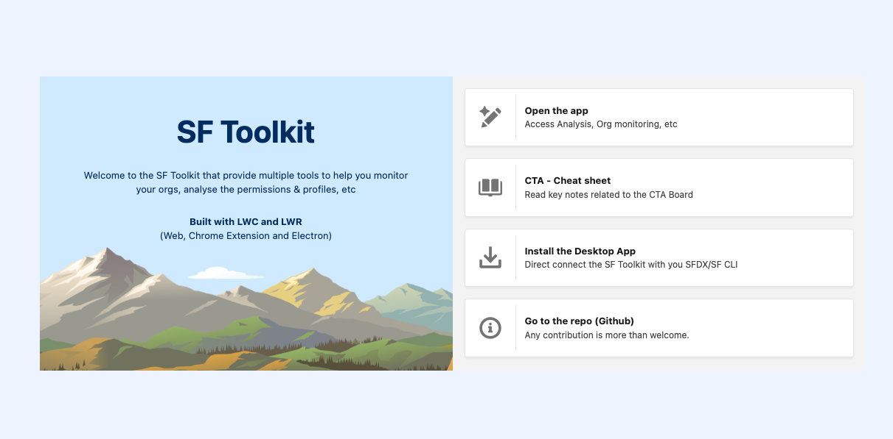
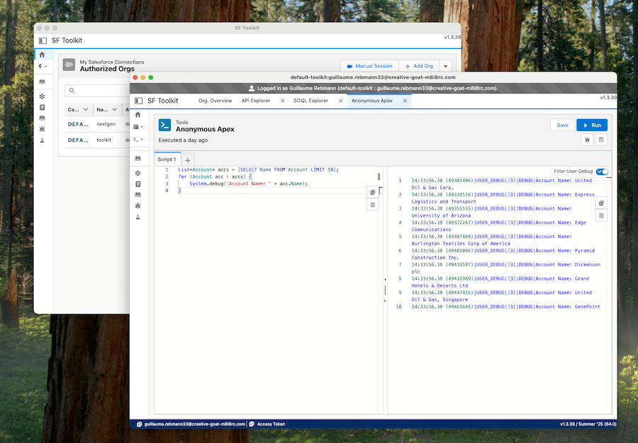

# SF Toolkit

The SF Toolkit repository provides a comprehensive suite of tools designed for Salesforce administration. These tools are accessible across multiple platforms, including the SF Toolkit website, an Electron desktop application, and a Chrome Extension, ensuring flexibility and convenience for Salesforce administrators.



## Roadmap

### Installation and Onboarding
- A custom installation page featuring a basic **How To** video or step-by-step guide to facilitate easy onboarding.

### Release Highlights
- A dedicated page showcasing all new features and updates.
- Direct links to the latest releases available within the Chrome Extension.

### Access, Profile, and Permission Analyzer
- ✅ Comprehensive user access and usage reporting, with options for PDF export.
- ✅ Profile and permission comparison tools, also supporting PDF export.
- ✅ Enhanced profile comparison features to easily identify similarities in access permissions, with printable formats.

### Metadata Explorer
- ✅ A robust metadata viewer for Salesforce components.
- ✅ A lightweight metadata editor supporting **LWC**, Aura, and Apex.

### SOQL Builder
- ✅ Comprehensive field and object dictionary.
- ✅ Integrated Monaco Editor for superior code editing.
- ✅ Capabilities for data export and multi-tab management.
- ✅ Features for recent and saved queries, with Einstein integration.

### Anonymous Apex
- ✅ Multi-tab support for managing multiple scripts.
- ✅ Monaco Editor for streamlined code writing.
- ✅ Features for recent and saved queries, with Einstein integration.

### API Explorer
- ✅ Support for HTTP methods: GET, POST, PUT, PATCH, DELETE.
- ✅ Integrated Monaco Editor for API request crafting.
- Features for recent and saved requests, multi-tab management, and Einstein integration.

### Platform Events Explorer
- ✅ Comprehensive support for platform events and Change Data Capture.
- ✅ Replay capabilities for events.
- ✅ Integrated Monaco Editor for event scripts.
- ✅ Quick Apex script execution and multi-tab subscription management.
- Features for managing recent subscriptions.

### AI Assistants
- ✅ Seamless integration with Einstein for AI-driven insights.
- ✅ Multi-dialog support within tabs.
- ✅ Support for Mermaid Diagrams and Salesforce Code Styling.
- ✅ Available as a Chrome and web app, with shortcut key activation and modal functionality on any webpage.
- Use the assistant to interact with any input field across platforms.

### Salesforce Documentation
- ✅ Access to a full data model and API/REST documentation for in-depth understanding.

### Credential Manager
- ✅ OAuth2.0 support for secure authentication.
- ✅ Group connection management using a category concept.
- ✅ Import/export capabilities from the extension, web app, and desktop application.
- ✅ Support for redirect URLs for organizations blocking API connections.
- Enhanced alias management to separate categories and names, impacting SF CLI usage.

### Org Analysis and Overview
- ✅ Comprehensive org dashboard with insights into license usage.
- Data and file storage usage metrics.
- Application, managed package, unlocked package, profile, permission, report, flow, and validation rule counts.
- Multi-currency support analysis.

### Chrome Extension
- ✅ Available in the Chrome Web Store with core features like Credential Manager, AI Assistant, and Documentation & Context Information.
- ✅ Injected quick search functionality for Salesforce pages.
- Enhanced option page and full localhost support for processing.

### Multi-Platform Support
- ✅ Chrome Extension available for installation [here](https://chromewebstore.google.com/detail/sf-toolkit-light/konbmllgicfccombdckckakhnmejjoei).
- ✅ Electron App for Mac OS available for download [here](https://github.com/grebmann1/sfdx-ui-light/releases/latest).
- Planned Electron App for Windows.

### Code Analyzer
- Ongoing development of a code extractor and analyzer.
- Planned integration with SFDX-HARDIS for org monitoring (Desktop only).

### Data and Object Assignment
- Analysis of layout assignments and usage.
- Field counts by object and list view counts by page layout.

### Future Ideas
- Metadata Global Loader with caching to optimize loading and API usage, including refresh capabilities.
- Middleware hooks for debugging callouts.
- Data model viewer and Experience Cloud guest user review.
- One-time use batch generator for streamlined batch processing.
- Nebula Logger Connector for monitoring logs.
- Full localhost support for the Chrome Extension (currently desktop only due to LWR restrictions).

## Features

### SF Toolkit Website

Access the full suite of Salesforce management tools at [SF Toolkit](https://www.sf-toolkit.com), including user access verification, connection management, and detailed profile and permission analysis.

### Electron Desktop App

The Electron-based desktop application leverages the Salesforce Developer Experience (SFDX) to provide a seamless desktop environment for managing Salesforce connections, analyzing access rights, and visualizing user permissions. Detailed setup and usage instructions are available within the app directories.



### Chrome Extension

The Chrome Extension integrates directly into your browser, offering quick access to SF Toolkit functionalities. It allows you to visualize profiles, manage connections, and export data as CSV or PDF, streamlining Salesforce access management from within the browser.


## Installation and Usage

### Install the Entire Repository
1. Clone the repository.
2. Run `npm install`.
3. Create a Salesforce Connected App and set up the following in a `.env` file:
   ```
   CLIENT_SECRET='XXXXX'
   CLIENT_ID='XXXX'
   ```

### SF Toolkit Website
- Visit [SF Toolkit](https://www.sf-toolkit.com) and connect your orgs. Note that org information is stored locally in the browser.

#### Run in Development Mode
- Execute `npm run start:dev:client`.

#### Run in Production Mode (Static Version)
1. Execute `npm run heroku-postbuild`.
2. Execute `npm run start:heroku`.

To test with Heroku (optional), after installing the Heroku CLI:
1. Execute `npm run heroku-postbuild`.
2. Execute `heroku local --port 3000`.

### Electron Desktop App
- Navigate to the specific repository: [GitHub](https://github.com/grebmann1/sfdx-ui-desktop).

### Chrome Extension
- Refer to the 'extension' directory for installation steps and usage guidelines.

#### Testing in Developer Mode (Chrome)
1. Clone the repository.
2. Run `npm install`.
3. Open `chrome://extensions/`.
4. Enable `Developer mode`.
5. Click `Load unpacked extension...`.
6. Select the folder `extension` containing the extension module.

## Contribution

We welcome contributions to enhance SF Toolkit. Feel free to fork the repository, make improvements, and submit pull requests.

## Open Source Acknowledgments

This tool incorporates components from the following open-source projects:

- **[LWC SOQL Builder](https://github.com/lwc-soql-builder/lwc-soql-builder)**  
  - Description: A dynamic and user-friendly tool for building Salesforce Object Query Language (SOQL) queries.
  - License: MIT
  - Technology: LWC & NodeJS

- **[Salesforce Inspector Reloaded](https://github.com/tprouvot/Salesforce-Inspector-reloaded)**  
  - Description: A reloaded version of the popular Salesforce Inspector Chrome extension.
  - License: MIT
  - Technology: JavaScript

## Support

For any issues, queries, or suggestions, please open an issue in the respective app's directory or contact us directly.

## License

This project is licensed under the MIT License.